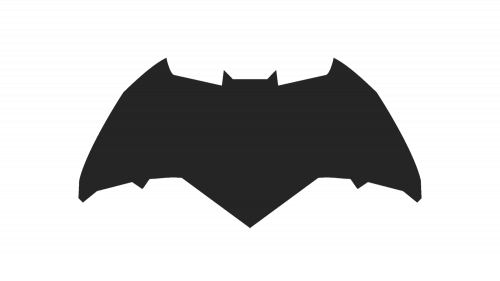
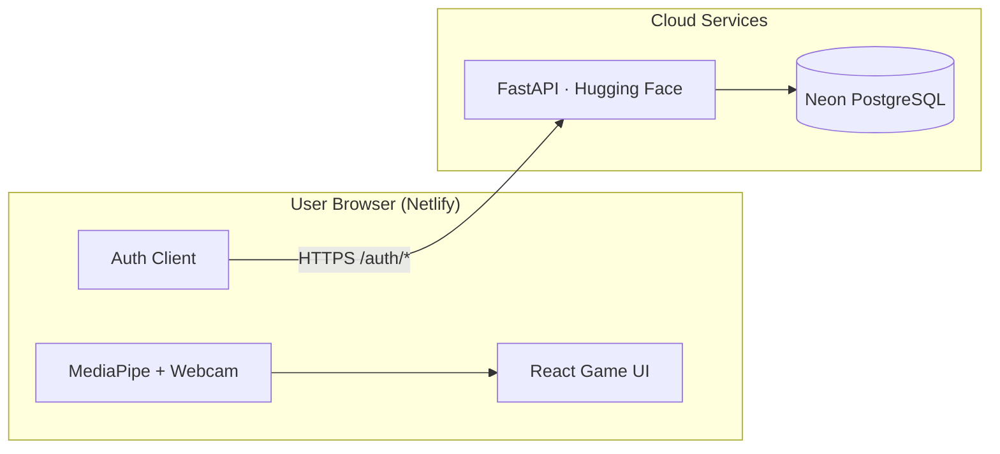

<p align="center">
  
</p>

<h1 align="center">Gotham Telekinesis</h1>

<p align="center">
  A hand-controlled arcade game — move Batman, slash Joker cards, and survive boss waves using real-time computer vision.
</p>

<p align="center">
  <a href="https://react.dev"></a>
  <a href="https://www.typescriptlang.org"></a>
  <a href="https://vite.dev"></a>
  <a href="https://www.netlify.com"></a>
</p>

<p align="center">
  <a href="https://github.com/aliashrafabbasi/AI-Telekinesis-Simulator"><strong>Backend API</strong></a>
  &nbsp;·&nbsp;
  <a href="https://huggingface.co/spaces/aliashrafabbasi/gotham-telekinesis-api"><strong>Live API</strong></a>
</p>

---

## Overview

**Gotham Telekinesis** is a full-stack web application that turns hand gestures into game input. Users authenticate, enable their webcam, and control Batman on screen using MediaPipe hand tracking — no controller required.

| Component | Technology | Role |
|-----------|------------|------|
| Frontend | React · TypeScript · Vite | Game UI, camera, hand tracking |
| Backend | FastAPI on Hugging Face | User authentication (JWT) |
| Database | Neon PostgreSQL | Account storage |
| Hosting | Netlify | Static frontend delivery |

> **Production design:** Hand tracking runs entirely in the user's browser. The backend handles auth only — no server-side camera is needed in the cloud.

---

## Table of Contents

- [Features](#features)
- [Architecture](#architecture)
- [Getting Started](#getting-started)
- [Configuration](#configuration)
- [Gameplay](#gameplay)
- [Deployment](#deployment)
- [Project Structure](#project-structure)
- [Scripts](#scripts)

---

## Features

**Authentication**
- Email / username registration and login
- JWT session with protected routes
- Automatic session restore on page reload

**Hand Tracking**
- Real-time webcam input via MediaPipe Hands
- Live preview panel with skeleton overlay
- Two operating modes: browser (production) and server (local dev)

**Gameplay**
- Telekinesis-style Batman movement mapped to hand position
- Open-hand gesture to slash normal Joker cards
- Closed-fist extreme mode for boss encounters
- Progressive difficulty with boss waves every 8 cards

**Interface**
- Gotham-themed responsive UI
- Connection and tracking status indicators
- Mobile, tablet, and desktop support

---

## Architecture



**Tracking modes**

| Mode | Env value | Camera | When to use |
|:----:|:---------:|--------|-------------|
| Browser | `browser` | User's device | Production · Netlify |
| Server | `server` | Docker backend | Local development |

---

## Getting Started

### Prerequisites

- Node.js 18+
- npm 9+
- A webcam (for browser mode)
- Backend running (for server mode only)

### Installation

```bash
git clone https://github.com/aliashrafabbasi/AI-Telekinesis-Simulator-frontend.git
cd AI-Telekinesis-Simulator-frontend
npm install
cp .env.example .env
```

MediaPipe assets are copied to `public/mediapipe/` automatically during `npm install`.

### Development

```bash
npm run dev
```

Open the URL shown in the terminal (default: `http://localhost:5173`).

For **server mode**, start the [backend](https://github.com/aliashrafabbasi/AI-Telekinesis-Simulator) first:

```bash
cd ../AI-Telekinesis-Simulator && docker compose up
```

### Production Build

```bash
npm run build
npm run preview
```

---

## Configuration

Copy `.env.example` to `.env` and activate **one** configuration block.

<details>
<summary><strong>Option A — Production (Netlify / browser tracking)</strong></summary>

```env
VITE_API_URL=https://aliashrafabbasi-gotham-telekinesis-api.hf.space
VITE_TRACKING_MODE=browser
```

</details>

<details>
<summary><strong>Option B — Local testing (Docker / server camera)</strong></summary>

```env
VITE_API_URL=http://127.0.0.1:7860
VITE_TRACKING_MODE=server
VITE_WS_URL=ws://127.0.0.1:7860/ws
VITE_PREVIEW_WS_URL=ws://127.0.0.1:7860/ws/preview
```

</details>

| Variable | Required | Description |
|----------|:--------:|-------------|
| `VITE_API_URL` | ✓ | Backend REST API base URL |
| `VITE_TRACKING_MODE` | — | `browser` (default) or `server` |
| `VITE_WS_URL` | Server only | Hand control WebSocket |
| `VITE_PREVIEW_WS_URL` | Server only | Camera preview WebSocket |

Restart the dev server after any `.env` change.

---

## Gameplay

| Step | Action |
|:----:|--------|
| 1 | Sign up or sign in |
| 2 | Allow camera access when prompted |
| 3 | Position your hand in the preview panel |
| 4 | **Hold a closed fist** to start the game |
| 5 | **Open hand** to slash normal Jokers |
| 6 | **Closed fist** for extreme slashes and boss cards |

---

## Deployment

### Netlify

1. Push this repository to GitHub
2. Import the repo at [app.netlify.com](https://app.netlify.com)
3. Confirm build settings from `netlify.toml`:

   | Setting | Value |
   |---------|-------|
   | Build command | `npm run build` |
   | Publish directory | `dist` |

4. Add environment variables under **Site configuration → Environment variables**:

   ```
   VITE_API_URL=https://aliashrafabbasi-gotham-telekinesis-api.hf.space
   VITE_TRACKING_MODE=browser
   ```

5. Update `CORS_ORIGINS` on the [backend HF Space](https://huggingface.co/spaces/aliashrafabbasi/gotham-telekinesis-api/settings) to include your Netlify URL:

   ```
   https://your-site.netlify.app,http://localhost:5173
   ```

6. Redeploy and verify: auth, camera, hand tracking, and gameplay

### End-user Requirements

- HTTPS connection (required for camera access)
- Webcam-enabled device
- Modern browser (Chrome, Edge, Firefox, or Safari)

---

## Project Structure

```
src/
├── api/              # HTTP client and auth endpoints
├── components/       # Shared UI components
├── config/           # Environment and game constants
├── context/          # React auth context
├── hooks/            # Hand tracking and game engine hooks
├── motion/           # Hand-to-screen coordinate mapping
├── pages/            # Login, signup, and game views
├── tracking/         # Browser-side MediaPipe integration
└── types/            # Shared TypeScript definitions

public/
├── logos/            # Game assets
└── mediapipe/        # MediaPipe WASM binaries
```

---

## Scripts

| Command | Description |
|---------|-------------|
| `npm run dev` | Start development server |
| `npm run build` | Type-check and build for production |
| `npm run preview` | Serve the production build locally |
| `npm run lint` | Run ESLint |

---

<p align="center">
  Built by <a href="https://github.com/aliashrafabbasi">aliashrafabbasi</a>
</p>
